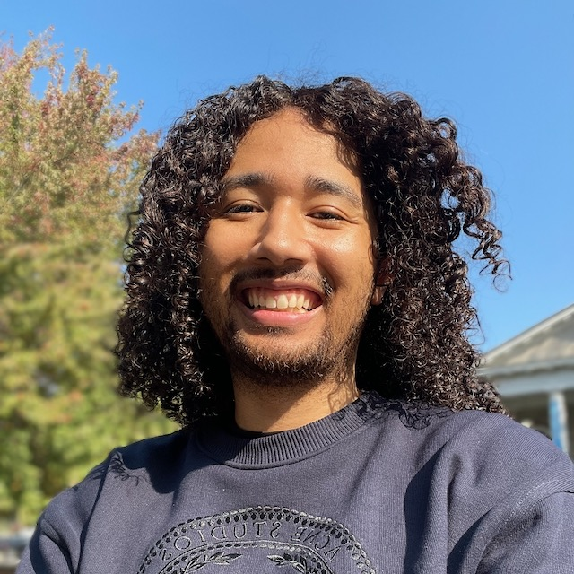
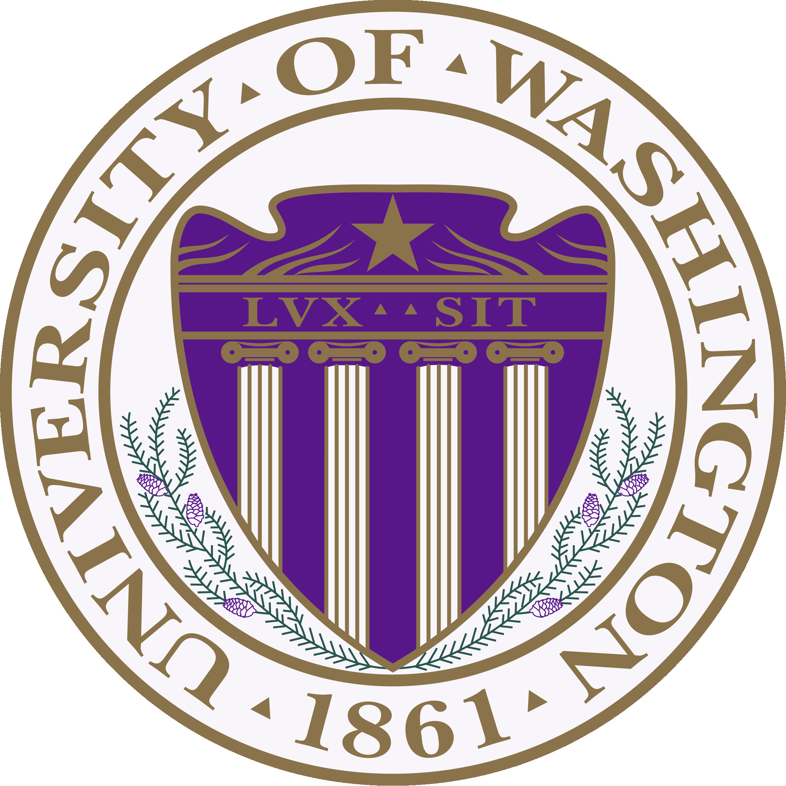

  

  # Kenny W. Lino
  Software Developer
  

  

  

  
  
  

  

---

## My "Why"

----

  

    

    Do you ever think about what to wear or how you present yourself?
    

  

    <iframe src="https://giphy.com/embed/xT9KVgmGTooXz0iDPW" width="480" height="270" frameBorder="0" class="giphy-embed" allowFullScreen></iframe>

  

----

<section data-background-image="https://giphy.com/embed/uBQNLeszLtiNO">

I'm interested in helping websites dress their best

</section>
----

- human aspect of tech:
- solving real world problems
- educating others
- creating apps that can entertain

[ESPICH, Linguistic's Honor Paper, Master's Paper]      

---
## My Background

----

### Software Developer

- (2023) Certificate for Advanced Software Development in Full-Stack JavaScript from Code Fellows

- Experience with:
- React
- Express
- MongoDB
- PostgreSQL
- Redux
- AWS

----

### (Computational) Linguist

  

  (2016) B.A. degree in Linguistics and Japanese from University of Washington
  

  

   <!-- .element width="400px" -->
  

----

- (2019) M.S. degree in Natural Language Processing from University of Basque Country / University of Malta

- Worked as a Japanese Linguist / Team Lead contracted @ Apple for ~4 years fixing Siri lexicon
- Working as a Japanese Linguist for Satori Reader, a website that produces stories for learners of Japanese

---

## My Top 3 Professional Competencies

----

### Communication

- Japanese / Korean tutor when working at UW

----

### Leadership

- Team Lead at Apple-- helped Misako throughout time / helped team learn more tech / helped cross-team conversations

- CODE-301 - final project

----

### Growth Mindset

- born as a navy brat = plenty of diversity
- first to attend higher education in my family
- love a great challenge

---

## My Biggest Challenge

----
Time Management

---
## Core Values

---
## My Top 2 Projects

----

### PicMySong

----

### Dungeons and Data

---

## My Top Target Company

---

## Fun Factor

----

### Dance

----

### Music

----

### Gaming

